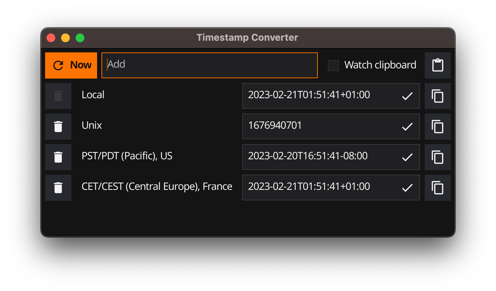
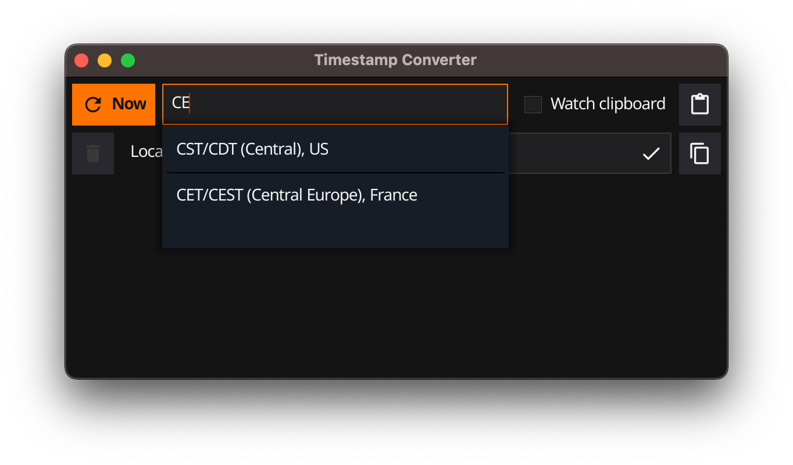
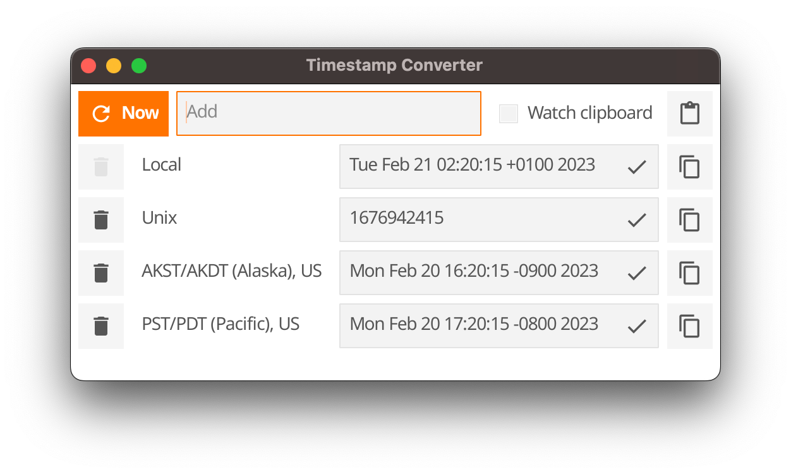

# About
App to support anyone who have to deal with timestamps in many timezones and formats.

  

Timestamp Converter is a application written in Go [<https://go.dev>] powered by Fyne tookit [<https://fyne.io/>].

---

## Features

* Main feature is to present the same timestamp in many timezones, with Unix Epoch too.

* For update time to current moment, use `Now` button.

* To add new timezone, use `Add` entry on top of window. After enetring few first letters, popup with suggestions will showup.

  

* `Watch clipboard` will monitor you clipboard for any valid timestamp which you may copy from any source.

* `Paste` button which will try to parse cliboard content as timestamp.

* `Trash` button to remove timezone from view.

* Timestamp entry. It will show date and time in given timezone. Additionaly you can edit timestamp right there. If value cannot be parsed as timestamp there will be a info about that.

* To make copy easy, on right side there is a button for each timezone which will copy entry content to you clipboard.

* Format menu let you choose way how timestamp is presented.

* Theme menu to switch between `Dark` and `Light` mode.

  

* Selected timeozones, format and theme will be saved for next run.

---
## Installation

Go to release section [<https://github.com/sharki13/timestamp-converter/releases>] and download package for your OS.

Notes:

* On Linux, unpack archive and run `make`.
* On MacOs, since app is not signed with trusted certificate, Gatekeeper by default will not allow you to run application. To omit that you have to open context menu on app with `Command` key pressed and then use `Open` action from menu.

---

## How to build

Built and tested with Go 1.19 and 1.20.

Dependecies:
* Go compiler -> <https://go.dev>

Due to Fyne dependecies, to build you will need C++ compiler.
* On Windows it will require mingw64.
* On MacOs it will require XCode.
* On Linux it will require gcc, additionaly with `xorg-dev` package.

---

### Build for Ad-hoc usage

1. Clone repository:

       git clone https://github.com/sharki13/timestamp-converter.git

2. Go to folder with sources.
3. Run via:

       go run .

---
### Release bulild

To make release build like those one present in release section it is recomended to use `fyne` toolkit.

1. Install fyne via:

        go install fyne.io/fyne/v2/cmd/fyne@latest

2. Make a package via:
* Windows:

      fyne package -os windows

* macOS:

      fyne package -os darwin

* Linux:

      fyne package -os linux

It will prepare binaries for given target OS.

Note: If your `go/bin` folder is not in path then command will look like:

    ~/go/bin/fyne package -os linux
